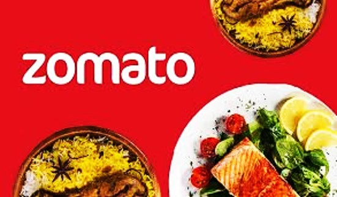

# Zomato - Fome Zero

  

## 1. Problema de Negócio

Como Cientista de Dados da empresa **Fome Zero**, sua principal tarefa é ajudar o CEO **Kleiton Guerra** a identificar pontos-chave da empresa, respondendo às perguntas que ele fizer utilizando dados!

A empresa **Fome Zero** é um marketplace de restaurantes. Seu core business é facilitar o encontro e negociações entre clientes e restaurantes. Os restaurantes cadastrados na plataforma disponibilizam informações como:

- Endereço
- Tipo de culinária servida
- Se aceitam reservas
- Se fazem entregas
- Nota de avaliação dos serviços e produtos

O CEO, recém-contratado, precisa entender melhor o negócio para tomar as melhores decisões estratégicas e alavancar ainda mais a Fome Zero. Para isso, ele precisa de uma análise dos dados da empresa e de dashboards que respondam às seguintes perguntas:

### **Geral**

1. Quantos restaurantes únicos estão registrados?
2. Quantos países únicos estão registrados?
3. Quantas cidades únicas estão registradas?
4. Qual o total de avaliações feitas?
5. Qual o total de tipos de culinária registrados?

### **Por País**

1. Qual o país com mais cidades registradas?
2. Qual o país com mais restaurantes registrados?
3. Qual o país com mais restaurantes de nível de preço igual a 4 registrados?
4. Qual o país com maior variedade de tipos de culinária?
5. Qual o país com mais avaliações feitas?
6. Qual o país com mais restaurantes que fazem entrega?
7. Qual o país com mais restaurantes que aceitam reservas?
8. Qual o país com maior média de avaliações?
9. Qual o país com maior nota média registrada?
10. Qual o país com a menor nota média registrada?
11. Qual a média de preço de um prato para dois por país?

### **Por Cidade**

1. Qual a cidade com mais restaurantes registrados?
2. Qual a cidade com mais restaurantes com nota média acima de 4?
3. Qual a cidade com mais restaurantes com nota média abaixo de 2.5?
4. Qual a cidade com o maior valor médio de um prato para dois?
5. Qual a cidade com maior variedade de tipos de culinária?
6. Qual a cidade com mais restaurantes que aceitam reservas?
7. Qual a cidade com mais restaurantes que fazem entregas?
8. Qual a cidade com mais restaurantes que aceitam pedidos online?

### **Por Restaurante**

1. Qual o restaurante com mais avaliações?
2. Qual o restaurante com a maior nota média?
3. Qual o restaurante com o maior valor de prato para duas pessoas?
4. Qual o restaurante brasileiro com a menor média de avaliação?
5. Qual o restaurante brasileiro com a maior média de avaliação?
6. Restaurantes que aceitam pedidos online possuem, na média, mais avaliações?
7. Restaurantes que fazem reservas possuem, na média, o maior valor de um prato para duas pessoas?
8. Restaurantes japoneses dos EUA possuem pratos para dois mais caros que churrascarias americanas (BBQ)?

### **Por Tipo de Culinária**

1. Restaurantes de culinária italiana: qual tem a maior e a menor média de avaliação?
2. Restaurantes de culinária americana: qual tem a maior e a menor média de avaliação?
3. Restaurantes de culinária árabe: qual tem a maior e a menor média de avaliação?
4. Restaurantes de culinária japonesa: qual tem a maior e a menor média de avaliação?
5. Restaurantes de culinária caseira: qual tem a maior e a menor média de avaliação?
6. Qual o tipo de culinária com o maior valor médio de prato para dois?
7. Qual o tipo de culinária com a maior nota média?
8. Qual o tipo de culinária com mais restaurantes que aceitam pedidos online e fazem entregas?

O objetivo desse projeto é criar um conjunto de dashboards para responder essas perguntas e facilitar a tomada de decisão do CEO.

---

## 2. Premissas Assumidas para a Análise

1. A análise foi realizada com dados relacionados a culinária do mundo inteiro.
2. E-commerce foi o modelo de negócio assumido.
3. As 4 principais visões do negócio são:
   - Visão geral dos restaurantes
   - Visão por país
   - Visão por cidade
   - Visão por culinária

---

## 3. Estratégia da Solução

### **1. Visão Geral dos Restaurantes**
- Restaurantes únicos
- Quantidade de países
- Quantidade de cidades
- Total de avaliações
- Tipos de culinária
- Participação dos restaurantes por país
- Geolocalização dos restaurantes

### **2. Visão por País**
- Top 10 países com mais cidades registradas
- Top 10 países com mais restaurantes registrados
- Top 10 países com maior média de avaliações
- Tabela resumo por país

### **3. Visão por Cidade**
- Top 10 cidades com mais restaurantes registrados
- Top 10 cidades com maior custo médio para dois
- Tabela resumo por cidade

### **4. Visão por Culinária**
- Total de tipos de culinária
- Tabela com maiores e menores avaliações
- Maior valor médio de prato para dois
- Mais restaurantes com e-commerce

---

## 4. Top 3 Insights de Dados

1. **Regiões de Oportunidade:** Focar em locais com alto potencial de crescimento com base em avaliações e restaurantes.
2. **Preferências Locais:** Ajustar ofertas para tipos de culinária mais populares em cada região.
3. **Otimização de Funcionalidades:** Priorizar pedidos online e reservas em regiões de alta demanda.

---

## 5. Produto Final

Um **painel online**, hospedado na nuvem e acessível em qualquer dispositivo conectado à internet.

**Acesse o painel aqui:** [Inserir Link Aqui](#)

---

## 6. Conclusão

A Fome Zero deve adotar uma estratégia baseada em dados para priorizar regiões com maior potencial, alinhar a oferta às preferências locais e otimizar funcionalidades, garantindo uma experiência diferenciada e fortalecendo sua posição no mercado.

---

## 7. Próximos Passos

1. **Validação e Limpeza dos Dados:** Garantir consistência e atualização.
2. **Desenvolvimento dos Dashboards:** Criar visões intuitivas para o CEO.
3. **Identificação de Áreas Prioritárias:** Focar em mercados de alto impacto.
4. **Estratégias Personalizadas:** Ajustar ofertas e serviços para cada região.
5. **Monitoramento Contínuo:** Atualizar dashboards regularmente e ajustar estratégias conforme necessário.

